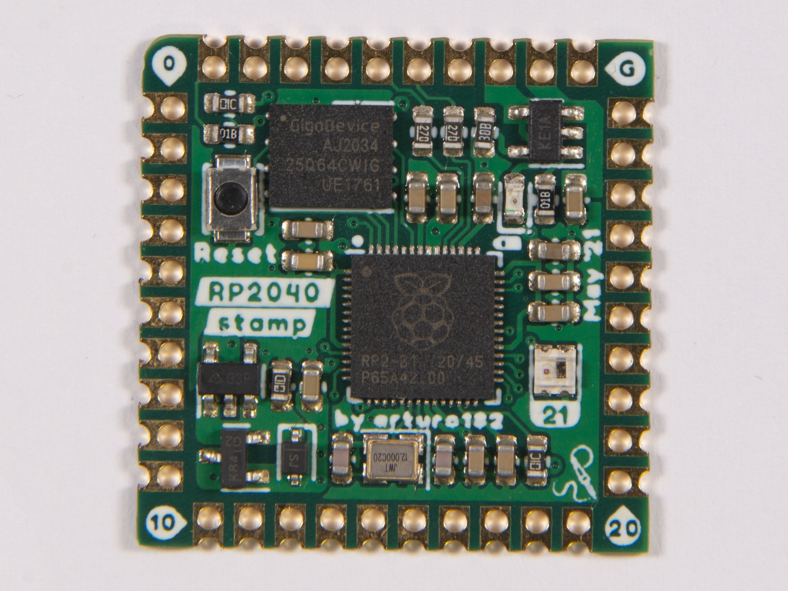

# The RP2040 Stamp

The Stamp was created to allow you to use the **Raspberry Pi RP2040** in your designs without having to solder small-pitch QFN chips or worry about lots of external circuitry.

All you need to get you started is a 5V supply or a LiPo battery. The Stamp will take care of the charging and switching the power sources.

The castellated edges with **2mm pitch** can be hand-soldered directly to a carrier board or by using pin headers. You can find footprints for many PCB programs [here](https://github.com/solderparty/rp2040_stamp_footprints).

At only **1 by 1 inch**, the Stamp packs a lot of features:
* **8MB of FLASH**
* **500mA 3.3V LDO**
* **All 30 GPIOs broken out**
* **A Neopixel**
* LiPo supply and charging circuit (with charging LED)
* USB broken out
* SWD broken out
* Reset Button
* 12MHz crystal

and of course, everything that comes with the Raspberry Pi RP2040 itself:
* Dual core ARM Cortex-M0+ @ 133MHz
* 264kB SRAM
* 2 UARTs
* 2 SPIs
* 2 I2Cs
* 16 PWM channels
* USB with Host and Device support

The RP2040 comes with a pre-programmed ROM UF2 Bootloader, by pulling the BOOTSEL pin low and resetting, or by double-pressing the RESET button (if the FW supports it), you can upload new firmware using the USB disk drive.

In addition to the Stamp, we also offer a reference design - the RP2040 Stamp Carrier.

The CircuitPython firmware for the Stamp comes with a built-in board file for the Carrier, you can access it using `import stamp_carrier_board as board`. After that, you can access all the Carrier pins and interfaces like you would with any other CPY board.

# Links

For more information visit https://rp2040-stamp.solder.party/

You can buy the Stamp and the Carrier boards from our Lectronz and Tindie stores:
https://lectronz.solder.party/
https://tindie.solder.party/
